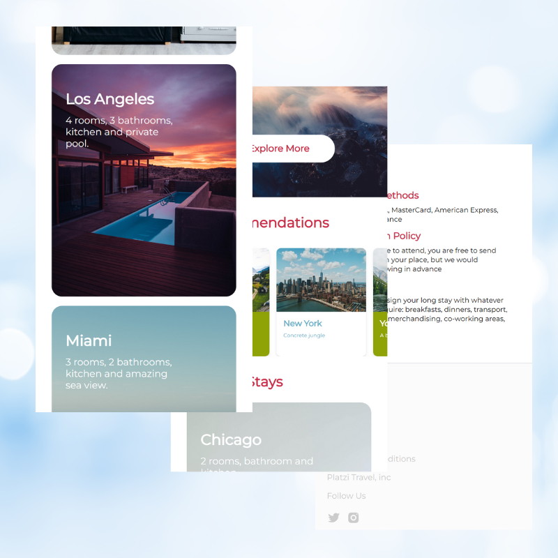
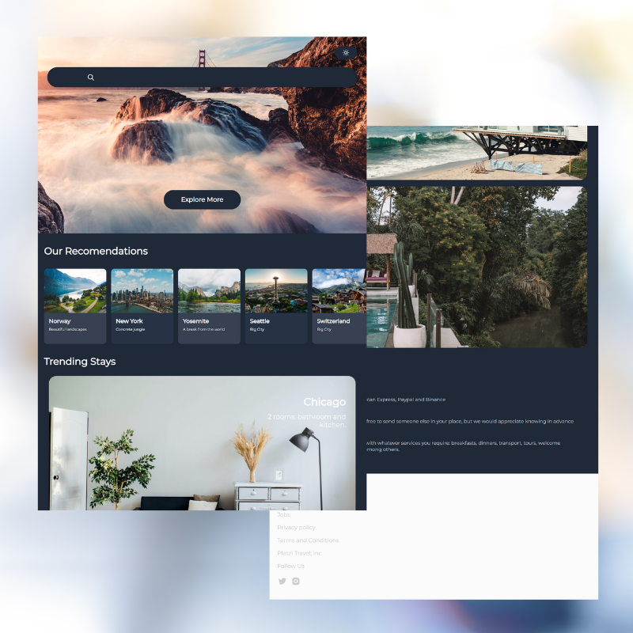
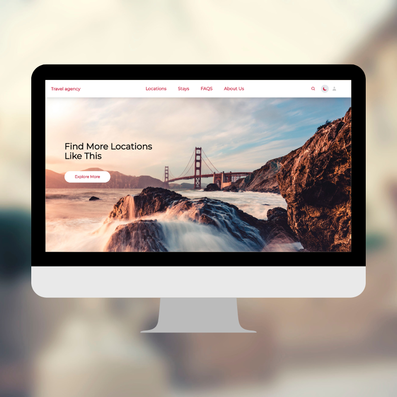

# Travel Agency Landing Page

## Table of contents

- [Overview](#overview)
  - [Resume](#resume)
  - [Features](#features)
  - [Screenshot](#screenshot)
- [Links](#links)
- [Built with](#built-with)
- [Author](#author)

## Overview

### Resume

This landing page was created as part of a practical exercise to test my own knowledge mainly in the CSS framework, Tailwind. It is important to mention that React.js was also used to obtain a cleaner code and a more optimized web page.

### Features

Users should be able to:

- View the optimal layout for the app depending on their device's screen size
- See hover states for all interactive elements on the page
- Navigate to the different sections on the page
- Toggle light and dark mode

### Screenshot

***Mobile***

 

***Tablet***

 

***Desktop***

 

## Links

- Live Site URL: [Travel Agency Landing Page](https://hugoriveros18.github.io/travel-agency-landing-page/)

## Built with

- Semantic HTML5 markup
- Flexbox - Grid
- Mobile-first workflow
- [Tailwind](https://tailwindcss.com/) - CSS Framework
- [React](https://reactjs.org/) - JS library

## Author

- Twitter - [@HugoRiverosF18](https://www.twitter.com/HugoRiverosF18)
- LinkedIN - [Hugo Felipe Riveros Fajardo](https://www.linkedin.com/in/hugo-felipe-riveros-fajardo-bb840292)
